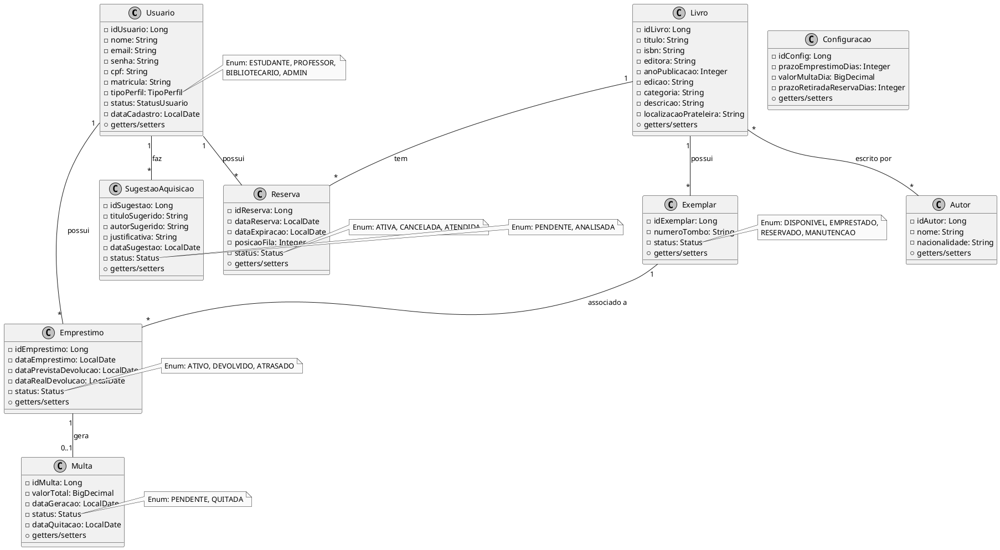

# Diagrama de Classes - SGBU (Sistema de Gerenciamento de Biblioteca Universitária)

## Entrega 02 - Projeto e MVP

**Universidade Federal de Uberlândia**  
**Faculdade de Computação**  
**Disciplina:** Engenharia de Software  
**Professor:** Prof. Fabiano Azevedo Dorça  

---

## 1. Diagrama de Classes (PlantUML)

---

## 2. Rastreabilidade de Requisitos (Mapeamento US -> Classes/Métodos)

| US | História de Usuário | Classes Envolvidas | Métodos Principais |
|:---|:---|:---|:---|
| US01 | Buscar livros no catálogo | LivroController, LivroService, LivroRepository | buscarPorTermo() |
| US02 | Visualizar detalhes do livro | LivroController, LivroService | buscarPorId(), getQuantidadeDisponivel() |
| US03 | Realizar reserva online | ReservaController, ReservaService | criarReserva(), listarPorUsuario() |
| US04 | Consultar histórico de empréstimos | EmprestimoController, EmprestimoService | buscarPorUsuario() |
| US05 | Notificações de prazo | NotificacaoService | notificarVencimento() |
| US06 | Visualizar multas pendentes | MultaController, MultaService | buscarPorUsuarioId(), buscarPendentesPorUsuarioId() |
| US07 | Login e logout seguro | AuthController, UserDetailsServiceImpl, SecurityConfig | loadUserByUsername() |
| US08 | Sugerir aquisição de títulos | SugestaoController, SugestaoService | criarSugestao() |
| US09 | Cadastrar livros no acervo | LivroController, LivroService | salvar() |
| US10 | Registrar empréstimo | EmprestimoController, EmprestimoService | registrar() |
| US11 | Registrar devolução | EmprestimoController, EmprestimoService | devolver() |
| US12 | Buscar usuário no balcão | UsuarioController, UsuarioService | buscarPorNomeOuMatricula() |
| US13 | Gerenciar reservas ativas | ReservaController, ReservaService | listarAtivas(), cancelarReserva() |
| US14 | Relatório de empréstimos | RelatorioController, RelatorioService | gerarRelatorioEmprestimos() |
| US15 | Cadastro de usuários (Admin) | UsuarioController, UsuarioService | salvar(), listarTodos(), toggleStatus() |
| US16 | Configurar parâmetros do sistema | ConfiguracaoController, ConfiguracaoService | salvarConfiguracao(), obterConfiguracao() |
| US17 | Dashboard administrativo | AdminController, RelatorioService | gerarDashboard() |

---

## 3. Decisões de Projeto

- **Arquitetura:** MVC (Model-View-Controller) com Spring Boot
- **Camada de Apresentação:** Thymeleaf com Bootstrap 5 via CDN
- **Camada de Negócio:** Services com injeção de dependência
- **Camada de Dados:** JPA/Hibernate com repositórios Spring Data
- **Autenticação:** Spring Security com BCrypt e sessão
- **Banco de Dados:** H2 em memória (desenvolvimento) / MySQL (produção)
- **Perfis de Acesso:** ADMIN, BIBLIOTECARIO, ESTUDANTE, PROFESSOR
